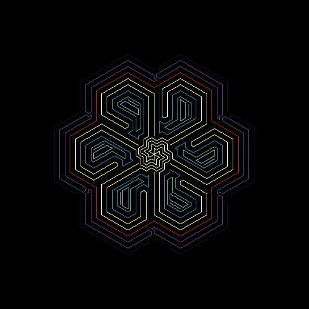
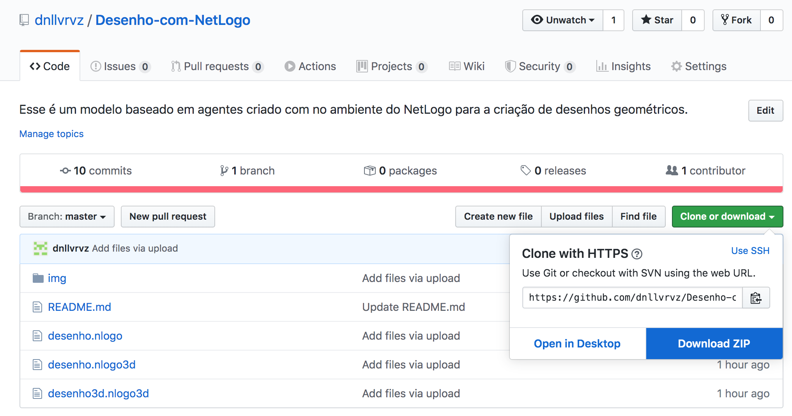

## Desenho-com-NetLogo

Esse é um modelo baseado em agentes criado no ambiente do [NetLogo](https://ccl.northwestern.edu/netlogo/) para a criação de desenhos geométricos.

Basicamente, com esse modelo nós somos capazes de criar uma quantidade específica de "agentes" que vão viver em um mundo virtual (2D ou 3D). Então podemos pedir para que esses agentes se distribuam nesse mundo virtual com angulações específicas entre eles (que nós definimos).

## Desenhando Manualmente

E com isso dizemos podemos pedir para que esses agentes se movam para frente ou para traz ou que rotacionem determinado ângulo para a direita ou para a esquerda. E a cada passo que eles dão (o comprimento do passo também determinamos) eles podem deixar um rastro no mundo virtual, o que seria como se eles tivessem uma caneta que vai desenhando nesse mundo. Com isso, temos a capacidade de criar desenhos geométricos lindos.

### Exemplos de Desenhos feitos "Manualmente"

## Desenhando com Loops

Alternativamente, podemos dizer para os agentes que a cada iteração da simulação, eles devem andar para frente um pouco e virar para um lado um pouco. Ambos parâmetros definimos. E assim comandamos os agentes a repetirem essas instruções em loop (por um número específico ou infinito de iterações), sempre aumentando o passo para a frente um pouquinho em relação ao último passo.

E dessas simples regras emergem movimentos hipnotizantes dos agentes no mundo, cujos rastros formam padrões lindos, muitas vezes formando mandalas e estruturas fractais.

### Exemplos de Desenhos feitos em Loop

Também é possível fazer o mesmo em um mundo virtual 3D, a partir do modelo 3D que está nesse repositório.

# Como brincar

Para fazer os seus próprios desenhos, você precisa baixar o NetLogo no seu computador. É **gratuíto** e você pode baixar [aqui](https://ccl.northwestern.edu/netlogo/6.1.1/). Depois você precisa baixar e abrir os modelos que estão *nesse repositório ([Desenho com NetLogo](https://github.com/dnllvrvz/Desenho-com-NetLogo)) do Github*. E então você abre qualquer um dos 3 modelos que estão aqui dentro do NetLogo no seu computador e começa a desenhar.

### Download dos modelos

Repare no botão azul na imagem abaixo:

### Modelo no NetLogo

### Exportar seus desenhos

Depois que você fizer seus desenhos, Clique em "File", depois "Export" e depois "Export View" para ter seu desenho salvo como uma image.

